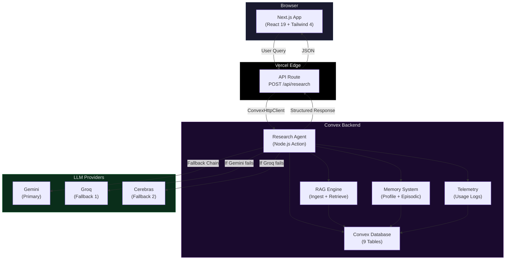
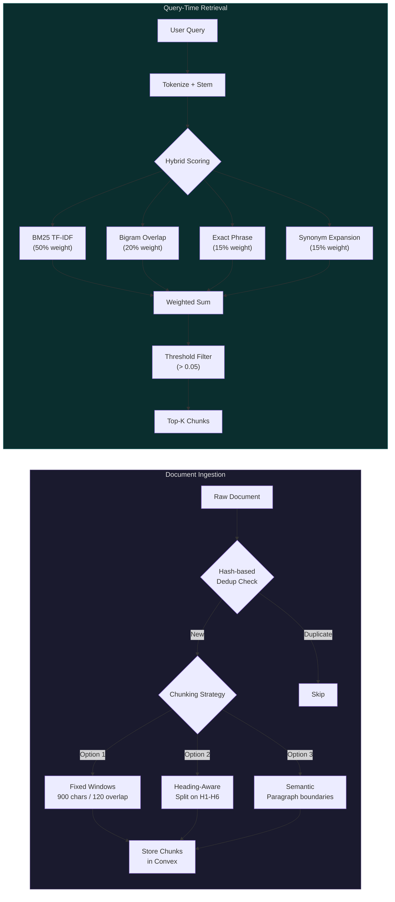
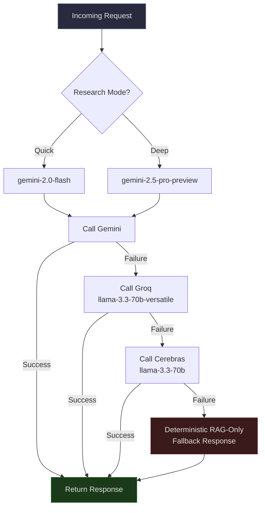

<p align="center">
  
  
  
  
  
  
</p>

try prism : https://prism-gamma-two.vercel.app/
<h1 align="center">Prism</h1>

<p align="center">
  <strong>AI-powered technical research agent with RAG, multi-model fallback, and persistent memory.</strong>
</p>

<p align="center">
  Think Perplexity, but self-hosted, extensible, and built on a modern serverless stack.<br/>
  Ask a question. Get a grounded, cited, confidence-scored answer in under 2 minutes.
</p>

---

## Table of Contents

- [Overview](#overview)
- [Architecture](#architecture)
  - [System Overview](#system-overview)
  - [Request Lifecycle](#request-lifecycle)
  - [RAG Pipeline](#rag-pipeline)
  - [LLM Fallback Chain](#llm-fallback-chain)
- [Tech Stack](#tech-stack)
- [Features](#features)
- [Monorepo Structure](#monorepo-structure)
- [Database Schema](#database-schema)
- [Getting Started](#getting-started)
- [Deployment](#deployment)
- [Scripts Reference](#scripts-reference)

---

## Overview

**Prism** is a production-oriented research assistant that takes a user's technical question, retrieves relevant context from an internal knowledge base (RAG), synthesizes an answer through frontier LLMs with automatic failover, and returns a structured, citation-backed response -- complete with confidence scores, tradeoff analysis, follow-up suggestions, and full cost/latency telemetry.

It supports two research modes:

| Mode | Target Latency | RAG Chunks | Max Tokens | Use Case |
|------|---------------|------------|------------|----------|
| **Quick** | < 2 min | Top 4 | 1,500 | Fast, focused synthesis |
| **Deep** | < 10 min | Top 8 | 4,096 | Thorough structured analysis with sections |

---

## Architecture

### System Overview



### Request Lifecycle

This is what happens every time a user submits a research query:

```mermaid
sequenceDiagram
    participant U as User
    participant W as Next.js Web App
    participant A as Research Agent
    participant R as RAG Engine
    participant M as Memory
    participant L as LLM Provider
    participant D as Convex DB

    U->>W: Submit query + mode
    W->>A: POST /api/research

    rect rgb(40, 20, 60)
        Note over A: Phase 1: Data Gathering
        A->>D: getSessionData()
        D-->>A: Profile, preferences
        A->>R: hybridScore(query, chunks)
        R-->>A: Ranked chunks + sources
        A->>M: Fetch episodic memories
        M-->>A: Past session summaries
    end

    rect rgb(20, 40, 60)
        Note over A: Phase 2: Ambiguity Check
        A->>A: isAmbiguous(query)?
        alt Query is ambiguous
            A-->>W: needs_clarification response
            W-->>U: "Can you be more specific?"
        end
    end

    rect rgb(20, 60, 40)
        Note over A: Phase 3: LLM Synthesis
        A->>A: Build system prompt<br/>(RAG context + memories + instructions)
        A->>L: callLLMWithFallback()
        L-->>A: Generated text + token usage
    end

    rect rgb(60, 40, 20)
        Note over A: Phase 4: Post-Processing
        A->>A: Parse structured output<br/>(follow-ups, tradeoffs, confidence)
        A->>A: Multi-signal confidence scoring
        A->>A: Zod validation (fallback if invalid)
        A->>L: Generate memory summary
        L-->>A: Session summary + tags
    end

    rect rgb(40, 20, 40)
        Note over A: Phase 5: Persistence
        A->>D: persistResearchResult()
        Note over D: Session, messages, insight,<br/>citations, memory, usage log
    end

    A-->>W: Full structured response
    W-->>U: Rendered answer + sources + diagnostics
```



### RAG Pipeline



### LLM Fallback Chain



---

## Tech Stack

| Layer | Technology | Details |
|-------|-----------|---------|
| **Frontend** | Next.js 15 (App Router) | React 19, TypeScript 5.7 |
| **Styling** | Tailwind CSS 4.2 | Glassmorphism, gradient text, scroll-reveal animations |
| **Backend** | Convex 1.20+ | Serverless reactive database + Node.js actions |
| **AI / LLMs** | Multi-provider fallback | Gemini (primary) -> Groq -> Cerebras |
| **RAG** | Custom in-Convex pipeline | BM25-inspired hybrid retrieval, no external vector DB |
| **Validation** | Zod 3.24 | Shared request/response contracts with runtime safety |
| **Markdown** | react-markdown 10.1 | Custom renderers with inline citation badges |
| **Package Manager** | pnpm 10.6.2 | Workspace protocol |
| **Deployment** | Vercel + Convex | Frontend on Vercel, backend on Convex Cloud |

---

## Features

### Research Engine
- **Dual modes** -- Quick (< 2 min) and Deep (< 10 min) research with mode-specific models and token budgets
- **Multi-model fallback** -- Gemini -> Groq -> Cerebras with automatic failover; deterministic RAG-only fallback if all providers fail
- **Ambiguity detection** -- Short or vague queries trigger clarification instead of a bad answer
- **Structured output parsing** -- Follow-up questions, tradeoff analysis (pros/cons), and LLM self-assessed confidence extracted from every response

### RAG (Retrieval-Augmented Generation)
- **Three chunking strategies** -- Fixed windows, heading-aware splits, and semantic paragraph boundaries
- **Hash-based deduplication** -- Prevents re-ingesting identical content
- **BM25-inspired hybrid scoring** -- Combines term frequency, bigram overlap, exact phrase matching, and synonym expansion (30+ technical terms)
- **Lightweight stemming** -- English suffix stemming with 30+ rules, no external NLP dependency

### Memory & Personalization
- **Profile preferences** -- Code example preference, response verbosity (concise/balanced/detailed), citation style (inline/footnote)
- **Natural language preference parsing** -- Say "I prefer code examples and detailed explanations" and it just works
- **Episodic memory** -- LLM-generated summaries of past sessions with topic tags, used as context in future queries

### Confidence Scoring
Multi-signal weighted score (clamped to 0.10--0.95):
- RAG quality (30%) -- chunk relevance + coverage ratio
- Answer quality (25%) -- length, code blocks, structured sections
- LLM self-assessment (25%) -- extracted from metadata block
- Source coverage (20%) -- distinct sources cited

### Telemetry & Cost Tracking
- Per-request: provider, model, route (primary/fallback), prompt/completion tokens, latency, estimated cost
- Aggregation: total requests, tokens, cost, errors, average latency, per-provider breakdown

### UI / UX
- **Perplexity-style chat interface** with sidebar, message thread, and input bar
- **Sources panel** with citation cards, relevance percentages, and highlight-on-click
- **Tradeoff cards** rendering pros/cons per approach
- **Clickable follow-up pills** that auto-submit the next query
- **Diagnostic badges** showing status, confidence %, latency, cost, provider/model
- **Loading step simulation** (retrieving -> analyzing -> generating)
- **Glassmorphism design** with gradient blobs, scroll-reveal animations, and `prefers-reduced-motion` support

### Safety & Guardrails
- **Zod validation** on every response -- invalid outputs trigger a safe fallback with `status: "fallback"` and confidence 0.15
- **Deterministic RAG-only fallback** when all LLM providers fail

---

## Monorepo Structure

```
prism/
├── apps/
│   └── web/                          # @ai/web -- Next.js frontend
│       ├── app/
│       │   ├── layout.tsx            # Root layout (fonts, metadata)
│       │   ├── page.tsx              # Landing page (Hero + Features)
│       │   ├── providers.tsx         # ConvexProvider wrapper
│       │   ├── globals.css           # Tailwind 4 theme + animations
│       │   ├── chat/
│       │   │   └── page.tsx          # Chat interface
│       │   └── api/research/
│       │       └── route.ts          # POST /api/research endpoint
│       ├── components/
│       │   ├── Header.tsx            # Scroll-aware nav
│       │   ├── HeroSection.tsx       # Animated hero
│       │   ├── ChatView.tsx          # Full chat UI
│       │   ├── MarkdownRenderer.tsx  # Custom markdown + citations
│       │   ├── SourcesPanel.tsx      # Citation cards
│       │   └── ...
│       └── lib/
│           └── env.ts               # Zod-validated env vars
│
├── packages/
│   ├── backend/                      # @ai/backend -- Convex serverless backend
│   │   └── convex/
│   │       ├── schema.ts            # 9-table database schema
│   │       ├── agents/
│   │       │   ├── researchAgent.ts  # Main orchestrator action
│   │       │   └── researchDb.ts     # Data queries + persistence
│   │       ├── llm/
│   │       │   └── providers.ts      # Gemini/Groq/Cerebras clients
│   │       ├── rag/
│   │       │   ├── ingest.ts         # Document ingestion pipeline
│   │       │   └── retrieve.ts       # BM25-inspired hybrid retrieval
│   │       ├── memory/
│   │       │   └── preferences.ts    # User preference CRUD
│   │       ├── metrics/
│   │       │   └── usage.ts          # Telemetry queries
│   │       └── lib/
│   │           └── utils.ts          # Shared utilities
│   │
│   └── shared/                       # @ai/shared -- Shared Zod contracts
│       ├── index.ts
│       └── schemas/
│           └── researchResponse.ts   # Response schema + types
│
├── docs/                             # Deployment + production notes
├── pnpm-workspace.yaml
├── vercel.json
└── package.json
```

## Getting Started

### Prerequisites

- **Node.js** >= 18
- **pnpm** >= 10.6
- A [Convex](https://convex.dev) account (free tier works)
- At least one LLM API key (Gemini, Groq, or Cerebras)

### 1. Clone and install

```bash
git clone <your-repo-url>
cd prism
pnpm install
```

### 2. Configure environment variables

**Frontend** (`apps/web/.env.local`):
```env
NEXT_PUBLIC_CONVEX_URL=https://your-deployment.convex.cloud
```

**Backend** (set in Convex dashboard or `.env`):
```env
CONVEX_DEPLOYMENT=your-deployment-name
GEMINI_API_KEY=your-gemini-key
GROQ_API_KEY=your-groq-key          # optional fallback
CEREBRAS_API_KEY=your-cerebras-key   # optional fallback
```

### 3. Start development servers

Run these in separate terminals:

```bash
# Terminal 1: Convex backend (watches + pushes functions)
pnpm dev:convex

# Terminal 2: Next.js frontend
pnpm dev:web
```

Open [http://localhost:3000](http://localhost:3000) and start researching.

---

## Deployment

### Frontend (Vercel)

```bash
# Vercel auto-detects Next.js
# Set these in Vercel dashboard:
#   NEXT_PUBLIC_CONVEX_URL = your production Convex URL
#
# Build command (auto):  pnpm --filter @ai/web build
# Install command:       pnpm install --frozen-lockfile=false
```

### Backend (Convex)

```bash
# Deploy to production
pnpm --filter @ai/backend deploy

# Set environment variables in Convex dashboard:
#   GEMINI_API_KEY, GROQ_API_KEY, CEREBRAS_API_KEY
```

**Deployment order:** Convex backend first, then Vercel frontend.

---

## Scripts Reference

| Script | Command | Description |
|--------|---------|-------------|
| `pnpm dev` | `pnpm dev:web` | Start Next.js dev server |
| `pnpm dev:web` | `next dev` | Start frontend on localhost:3000 |
| `pnpm dev:convex` | `convex dev` | Start Convex dev server (watch mode) |
| `pnpm build` | `next build` | Production build |
| `pnpm lint` | `next lint` | Run ESLint on web app |
| `pnpm typecheck` | Sequential typecheck | Typecheck all packages (`shared` -> `backend` -> `web`) |

---

<p align="center">
  Built with Convex, Next.js, and too much ☕.
</p>
